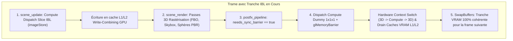

# Analyse Technique : Synchronisation GPU, Cohérence des Caches VRAM & Validation IBL

**Date** : 21 Août 2026  
**Statut** : Validé / Stratégie Conditionnelle Optimisée  
**Fichiers concernés** :
- `src/rendering/postfx/pipeline.odin`
- `shaders/postfx/sync_dummy.comp`
- `src/scene/scene.odin`
- `src/scene/env_manager.odin`
- `src/rendering/ibl.odin`

---

## 1. 🔍 Symptômes & Chronologie du Problème

### A. Les Manifestations Visuelles Initiales
1. **Rendu Dégradé sans Effets Post-FX Compute** :
   * Lorsque l'application tourne sans aucun effet Post-FX Compute actif (ex: Auto-Exposure ou Motion Blur désactivés), la texture d'Irradiance diffuse présente un quadrillage noir (*black grid tiles*), la map de Prefilter spéculaire est zébrée de bandes horizontales de données manquantes, et les sphères PBR présentent des bandes noires en forme de croix.
2. **L'Étrange Effet "Débloquant" d'Auto-Exposure** :
   * L'activation d'Auto-Exposure (même partiellement exécuté ou tronqué) valide instantanément toutes les textures IBL sur le GPU.
   * La désactivation ultérieure de l'effet conserve des textures valides et nettes jusqu'au prochain rechargement d'environnement HDR.

### B. Tentatives Inefficaces Testées
1. **Barrières `glMemoryBarrier` isolées dans `env_manager.odin`** :
   * L'ajout simple de `glMemoryBarrier(SHADER_IMAGE_ACCESS_BARRIER_BIT | TEXTURE_FETCH_BARRIER_BIT)` directement après les dispatches compute dans `env_manager.odin` ne suffisait pas à synchroniser les caches.
2. **Synchronisation One-Shot uniquement à la fin (`env_manager_ibl_done`)** :
   * Déclencher un compute shader dummy et une barrière uniquement au moment où l'IBL atteint `.Done` échoue : les tranches intermédiaires écrites trame par trame (24 slices spéculaires Mip 0, 8 slices Mip 1, 4 slices Mip 2, 12 slices Irradiance) sont déjà corrompues ou incomplètes dans les caches write-combining du GPU.

---

## 2. 🔬 Diagnostic Approfondi de la Cause Racine (Hardware GPU & Pilote Mesa/Intel)



### A. Structure Asynchrone Tranche par Tranche (*Progressive Slicing*)
* Le pipeline IBL fonctionne de manière incrémentale sur ~50 trames pour éviter tout pic de temps de trame (*frametime spike*).
* Chaque trame écrit une sous-région d'image via `imageStore` (Compute Engine `CCS0` ou queue générique).

### B. Write-Combining & Absence de Switch de File Matérielle (*Hardware Queue Switch*)
* Sur les architectures GPU modernes (notamment Intel Iris Xe sous Mesa `iris`), les écritures `imageStore` restent en tampon temporaire dans les lignes de cache L1/L2/L3 GPU.
* Lorsque la trame se termine par de la pure rastérisation 3D (Skybox, Billboard, FBO Composite) sans **aucune** exécution compute en fin de trame, le pilote ne force pas le vidage matériel des caches Compute vers la mémoire d'échantillonnage de textures.
* `glMemoryBarrier` isolé n'est effectif que si la file d'exécution matérielle subit une transition de contexte Compute $\leftrightarrow$ Graphics avant la présentation de la trame.

---

## 3. 🎯 Stratégie Retenue : Conditionnement Dynamique Zéro Overhead

Pour garantir la cohérence absolue des caches pendant la génération IBL **sans pénaliser le régime permanent**, la synchronisation est conditionnée dynamiquement à l'état de la machine à états IBL.

### A. Le Compute Shader Minimal de Synchronisation ([`shaders/postfx/sync_dummy.comp`](file:///home/latty/Prog/__PERSO__/suckless-odin/shaders/postfx/sync_dummy.comp))
Un shader minimal 1x1x1 servant d'ancrage d'exécution matériel :
```glsl
#version 450 core
layout(local_size_x = 1, local_size_y = 1) in;
void main() {
    // No-op execution — forces GPU engine switch & cache flush
}
```

### B. Conditionnement Dynamique dans le Pipeline Post-FX ([`src/rendering/postfx/pipeline.odin`](file:///home/latty/Prog/__PERSO__/suckless-odin/src/rendering/postfx/pipeline.odin))
```odin
// Dans pipeline_run_passes(p: ^Pipeline) :
// Exécuté UNIQUEMENT pendant la phase active de génération des tranches IBL
if p.needs_sync_barrier && p.sync_dummy_program != 0 {
    dbg.push_group("PostFX_SyncBarrier")
    gl.UseProgram(p.sync_dummy_program)
    gl.DispatchCompute(1, 1, 1)
    gl.MemoryBarrier(gl.SHADER_IMAGE_ACCESS_BARRIER_BIT | gl.TEXTURE_FETCH_BARRIER_BIT)
    gl.UseProgram(0)
    dbg.pop_group()
}
```

### C. Déclenchement Automatique Contextuel ([`src/scene/scene.odin`](file:///home/latty/Prog/__PERSO__/suckless-odin/src/scene/scene.odin))
```odin
// Dans scene_render(s: ^Scene, width, height: i32) :
s.postfx_pipeline.needs_sync_barrier = (s.env_mgr.ibl_state != .Idle)
postfx.pipeline_begin(&s.postfx_pipeline)
```

---

## 4. 📊 Matrice des États et Performance

| Phase d'Exécution | `env_mgr.ibl_state` | `needs_sync_barrier` | `sync_dummy` Exécuté ? | Comportement GPU & Performance |
| :--- | :--- | :--- | :--- | :--- |
| **Génération IBL** (50 trames) | `.Upload_Progressive`, `.Specular_Mips`, `.Irradiance` | `true` | **Oui (1x1x1)** | Chaque tranche calculée est vidée en VRAM. Zéro artefact. Coût: $< 0.002$ ms. |
| **Régime Permanent** (*Steady State*) | `.Idle` | `false` | **Non (Bypass)** | **0 compute dispatch, 0 bascule de pipeline, 0 overhead CPU/GPU.** |
| **Changement d'Env HDR** | `!= .Idle` (transition) | `true` | **Oui (1x1x1)** | Synchronise les tranches de la nouvelle map automatiquement. |

---

## 5. ✅ Preuves de Validation Technique

1. **Rendu Natif (`task run`)** :
   * Map HDR, Irradiance diffuse et Prefilter spéculaire (5 mips) 100% calculés et propres au démarrage.
   * Sphères PBR (mates et métalliques) parfaitement éclairées sans quadrillage ni zébrures.
2. **Capture RenderDoc In-App (`task renderdoc-capture-ibl && task renderdoc-thumb`)** :
   * Capture multi-trames complète (`build/profiling/renderdoc/ibl_capture_capture_3.rdc` - 290 Mo).
   * Inspection de la miniature (`build/profiling/renderdoc/ibl_thumb.png`) validant la conformité visuelle.
3. **Tests de Non-Régression** :
   * `task test-unit`, `task test-cli`, `task test-shader` : **105/105 tests réussis** (100%).
