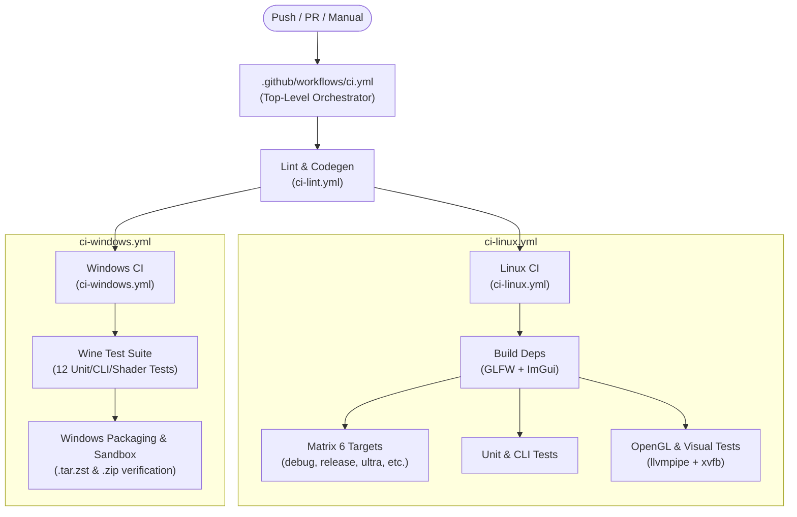

# CI/CD & Build System

## 1. Build Configuration & Targets

The project uses separate output directories per build configuration to avoid artifact collisions:

```text
build/
├── debug/suckless-odin       # Debug symbols, assertions enabled
├── release/suckless-odin     # Optimized (-o:speed), stripped, headless/GUI
└── sanitize/suckless-odin    # AddressSanitizer instrumented
```

### Build Targets (Taskfile.yml)

| Recipe | Output | Odin Flags | Use Case |
|---|---|---|---|
| `task build` | `build/debug/` | `-debug -use-separate-modules` | Development, rapid iteration |
| `task build-fast-release` | `build/fast-release/` | `-o:minimal -use-separate-modules` | Quick optimized build |
| `task build-release` | `build/release/` | `-o:speed -use-separate-modules` | Production Linux performance testing |
| `task build-ultra` | `build/ultra/` | `-o:aggressive -no-bounds-check -no-type-assert` | Maximum benchmark throughput |
| `task build-strict` | `build/debug/` | `-debug -vet -strict-style -warnings-as-errors` | Pre-commit quality gate |
| `task build-sanitize` | `build/sanitize/` | `-debug -use-separate-modules -sanitize:address` | Memory error & leak detection |
| `task build-win-release` | `build-windows/release/` | `-target:windows_amd64 -o:speed` | Production Windows binary |

---

## 2. CI/CD Architecture (Decoupled Modular Design)

The CI pipeline uses a **modular, reusable architecture** combining lightweight orchestration (`workflow_call`), reusable GitHub Composite Actions, and standalone CI shell scripts.

### High-Level Topology



---

## 3. Workflows Breakdown

### Top-Level Orchestrator ([`.github/workflows/ci.yml`](../.github/workflows/ci.yml))

Coordinates all sub-workflows concurrently using standard GitHub Actions `workflow_call` interfaces. It replaces legacy monolithic 500+ line workflows with a clean ~30 line coordinator.

### Reusable Sub-Workflows

| Workflow | File | Triggers | Roles & Steps |
|---|---|---|---|
| **CI Lint** | [`.github/workflows/ci-lint.yml`](../.github/workflows/ci-lint.yml) | `workflow_call`, `workflow_dispatch` | Ruff lint/format, State Machine TLA+ codegen parity check, `odin check -vet -strict-style`. |
| **CI Linux** | [`.github/workflows/ci-linux.yml`](../.github/workflows/ci-linux.yml) | `workflow_call`, `workflow_dispatch` | Dependency build (GLFW 3.4 shared, ImGui .a), 6 matrix target builds, Unit/CLI/Shader tests, headless OpenGL & visual regression under xvfb. |
| **CI Windows** | [`.github/workflows/ci-windows.yml`](../.github/workflows/ci-windows.yml) | `workflow_call`, `workflow_dispatch` | Cross-compilation with Clang-19/LLD-19/MinGW, 12 test suites executed under Wine, `.tar.zst`/`.zip` packaging & sandboxed distribution verification. |
| **Docker CI Image** | [`.github/workflows/docker-ci-image.yml`](../.github/workflows/docker-ci-image.yml) | `push` on `Dockerfile.ci`, `workflow_dispatch` | Builds and publishes `ghcr.io/yoyonel-lab/suckless-odin-ci:latest` to GitHub Container Registry with BuildKit GHA layer caching. |
| **Nightly Chaos** | [`.github/workflows/nightly.yml`](../.github/workflows/nightly.yml) | `schedule (0 2 * * *)`, `workflow_dispatch` | Stochastic concurrent temporal chaos fuzzer under headless Xvfb with core dump generation and markdown diagnostics summary. |
| **Release** | [`.github/workflows/release.yml`](../.github/workflows/release.yml) | `push tags (v*)`, `workflow_dispatch` | Packages Linux AMD64 and Windows x86_64 distributions and publishes GitHub Release with SHA-256 checksums. |

---

## 4. Reusable Composite Actions ([`.github/actions/`](../.github/actions/))

To eliminate boilerplate across workflows, reusable composite actions encapsulate recurring toolchain setup:

1. **[`setup-odin`](../.github/actions/setup-odin/action.yml)**:
   - Downloads, caches, and configures the pinned Odin compiler (`dev-2026-05`).
   - Compiles STB dependencies into `$ODIN_ROOT/vendor/stb/src`.
2. **[`setup-linux-deps`](../.github/actions/setup-linux-deps/action.yml)**:
   - Installs apt packages (X11, Mesa, xvfb).
   - Deploys cached GLFW 3.4 shared libraries and ImGui static library artifacts.
3. **[`setup-windows-toolchain`](../.github/actions/setup-windows-toolchain/action.yml)**:
   - Configures MinGW-w64, Clang-19, LLD-19, Wine64, and Task.
   - Sets symlinks for `clang`, `lld`, `llvm-ar`, and `wine`.

---

## 5. Standalone CI Scripts ([`scripts/ci/`](../scripts/ci/))

All shell logic previously inlined in YAML is isolated into standalone bash scripts, testable locally:

- [`scripts/ci/setup_odin.sh`](../scripts/ci/setup_odin.sh) : Compiles STB and sets up Odin.
- [`scripts/ci/verify_codegen.sh`](../scripts/ci/verify_codegen.sh) : Runs codegen parity verification.
- [`scripts/ci/build_glfw_shared.sh`](../scripts/ci/build_glfw_shared.sh) : Compiles GLFW 3.4 shared library.
- [`scripts/ci/install_glfw_system.sh`](../scripts/ci/install_glfw_system.sh) : Deploys GLFW into `/usr/local/lib`.
- [`scripts/ci/build_imgui_linux.sh`](../scripts/ci/build_imgui_linux.sh) : Generates ImGui bindings and compiles `.a`.
- [`scripts/ci/setup_linux_system.sh`](../scripts/ci/setup_linux_system.sh) : Installs system packages.
- [`scripts/ci/setup_win_toolchain.sh`](../scripts/ci/setup_win_toolchain.sh) : Sets up Clang-19 Windows cross-toolchain.

---

## 6. Local ISO Docker Environment (`Dockerfile.ci`)

To ensure **100% reproducibility between local development and remote CI**, the project maintains an ISO Docker container mirroring `ubuntu:24.04` and GitHub Actions runners.

### Features

- **BuildKit APT Cache Mounts**: `RUN --mount=type=cache,target=/var/cache/apt` eliminates re-downloading `.deb` packages.
- **Full Toolchain**: Includes Clang-19, MinGW, Wine, Wayland, Mesa llvmpipe, and Task.

### Commands

```bash
# Build local ISO image with BuildKit
task ci-docker-build

# Run full CI test suite in container (identical to GitHub Actions)
task ci-docker mode=all

# Run specific targeted modes
task ci-docker mode=test-unit
task ci-docker mode=test-gl
task ci-docker mode=test-win
task ci-docker mode=package-win
```

---

## 7. Quality Gates & Pre-commit Hooks

Pre-commit hooks are managed via `.pre-commit-config.yaml`:

```bash
# Install hooks
task pre-commit-install

# Run manually
task check
task lint
```

| Stage | Hook | Action |
|---|---|---|
| `pre-commit` | `codegen-check` | State Machine TLA+ synchronization verification |
| `pre-commit` | `odin check` | `odin check src/ -vet -strict-style -warnings-as-errors` |
| `pre-commit` | `markdownlint-cli2` | Markdown style compliance |
| `pre-push` | `odin-build` | Debug build verification |
| `pre-push` | `odin-test-unit` | Unit test execution |
| `pre-push` | `odin-test-cli` | CLI test execution |
| `pre-push` | `odin-test-shader` | Shader CPU test execution |
