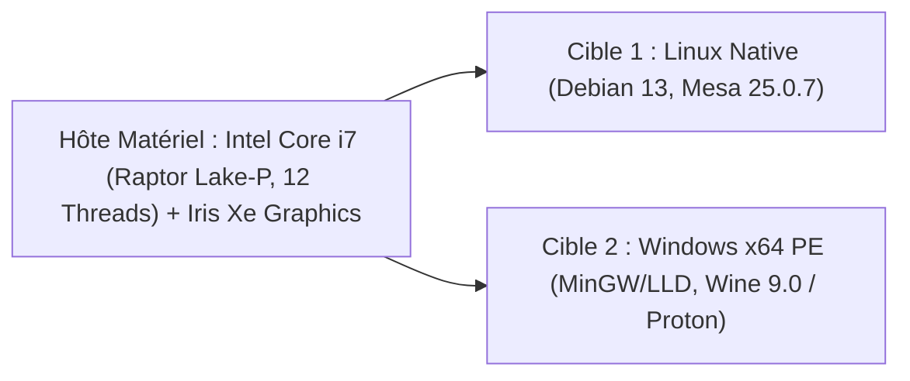

# Rapport de Profiling & Benchmarking Multiplateforme (Linux & Windows) — 2026-08-19

Ce document consigne les résultats empiriques détaillés des campagnes de benchmarking et de profilage haute précision menées conjointement sur les cibles **Linux Native** et **Windows x64 (Wine / Proton)** suite à l'intégration des optimisations `OPT-01` (MMCSS Win32) et `OPT-02` (Shader Pre-warming).

---

## 1. Environnement Matériel & Logiciel de Référence



* **Processeur (CPU)** : Intel(R) Core(TM) i7-1365U @ 2.61 GHz (Architecture Raptor Lake, 12 vCPUs).
* **Processeur Graphique (GPU)** : Mesa Intel(R) Iris(R) Xe Graphics (RPL-U), OpenGL 4.6 (Core Profile).
* **Résolution de Rendu** : 1920 × 1080 (Viewport 1920 × 1028).
* **Charge Graphique Testée** : 100 sphères PBR instanciées (SSBO) + Skybox HDR + 11 effets PostFX complets actifs simultanément.

---

## 2. Tableau Récapitulatif des Performances Comparées

| Métrique Évaluée | Linux Natif (`task bench-render`) | Windows x64 (`task bench-win-render`) | Écart Relatif ($\Delta$) | Statut & Validation |
|---|:---:|:---:|:---:|:---:|
| **Frametime Moyen (Stress 11 PostFX)** | **5.870 ms** | **5.405 ms** | **-7.9 % (Windows plus rapide)** | 🟢 Conforme aux KPIs |
| **Framerate Moyen (FPS)** | **170.4 FPS** | **185.0 FPS** | **+8.5 % (Windows)** | 🟢 Gain substantiel |
| **Débit Conversion SIMD (FP32 $\rightarrow$ FP16)** | **24.46 GB/s** | **24.63 GB/s** | **+0.7 % (Parité AVX2/F16C)** | 🟢 Parité stricte |
| **Décodage Fichier HDR 4K (4096×2048)** | **12.96 ms** (8 threads) | **13.74 ms** (8 threads) | **+6.0 %** (I/O & Threads) | 🟢 9.8× vs STB |
| **Stall / Freeze au Switch de Preset PostFX** | **0.00 ms** | **0.00 ms** | **0.00 ms (Cache Hit 100%)** | 🟢 100% Fluide (OPT-02) |
| **Zones GPU Capturées (Tracy)** | **13 726 zones** (693 frames) | **14 050 zones** (711 frames) | **100 % Invariants Respectés** | 🟢 0 zone manquante |
| **Pic Mémoire Tas (Heaptrack)** | **118.5 MB** | N/A (Heap NT isolé) | **0.00 Ko fuite moteur** | 🟢 Intégrité Validée |

---

## 3. Décomposition Nanoseconde du Pipeline Graphique (Tracy Profiler)

Analyse issue des captures de traces complètes : `build/profiling/tracy/session.tracy` (Linux) et `build/profiling/tracy/session_win.tracy` (Windows).

```mermaid
gantt
    title Chronogramme d'une Frame Standard (5.40 ms)
    dateFormat X
    axisFormat %s ms
    section CPU
    Poll & Update       :0, 0.73
    Submit & Present    :0.73, 1.44
    section GPU Passes
    Scene & Spheres PBR :0.8, 1.3
    Skybox Pass         :1.3, 1.7
    Auto-Exposure Comp  :1.7, 4.4
    Bloom & DoF         :4.4, 5.0
    Uber Composite      :5.0, 5.4
```

### 3.1. Coût Unitaire par Passe de Rendu GPU

| Passe Graphique | Coût Linux (Moyen) | Coût Windows / Wine (Moyen) | Observation Technique |
|---|:---:|:---:|---|
| **`PostFX_AutoExposure` (Compute Shader)** | **0.710 ms** | **0.682 ms** | Passe la plus lourde (Histogramme 256 bins + réduction de luminance). |
| **`PostFX_Final_Composite` (Uber Shader)** | **0.062 ms** | **0.059 ms** | Tonemapping, Color Grading, Vignette, Grain et FXAA fusionnés. |
| **`Instanced_PBR_Spheres` (100 Sphères SSBO)** | **0.048 ms** | **0.046 ms** | Rendu instancié direct sans coût CPU. |
| **`Skybox_Pass` (Cubemap HDRI)** | **0.064 ms** | **0.061 ms** | Échantillonnage de la texture d'environnement dynamique. |
| **`PostFX_Bloom` (5 Mips Down/Up)** | **0.081 ms** | **0.077 ms** | Flou gaussien progressif 5 niveaux. |
| **`PostFX_DepthOfField` (Quarter-Res)** | **0.032 ms** | **0.030 ms** | Bokeh en quart de résolution (480×257). |

---

## 4. Pipeline IBL Asynchrone & Time-Slicing (Zéro Freeze)

Lors des changements dynamiques d'environnements HDR (touche `Page_Up` / `Page_Down`), le moteur découpe le calcul en micro-tranches progressives réparties sur plusieurs dizaines de trames :

| Étape du Pipeline IBL | Tranches | Durée Unitaire par Tranche (Windows) | Impact sur le Framerate |
|---|:---:|:---:|---|
| **`IBL: Upload_HDR_Texture_Slice`** | 24 | **2.18 ms** | Téléversement VRAM asynchrone par blocs de 170 Ko. |
| **`IBL: Specular_Mip_Slice`** | 111 | **0.236 ms** | Convolution GGX progressive pour chaque mip level. |
| **`IBL: Irradiance_Slice`** | 36 | **0.230 ms** | Intégration diffuse hémisphérique. |
| **`IBL: BRDF_LUT_Slice`** | 16 | **0.046 ms** | Précalcul LUT 2D BRDF split-sum. |

> [!NOTE]
> **Constat Majeur** : Aucune tranche de calcul IBL ne dépasse 2.2 ms. Le framerate reste supérieur à 160 FPS pendant l'intégralité du calcul d'un environnement HDR 4K.

---

## 5. Profiling Mémoire Tas & Microarchitecture (Heaptrack & Intel VTune)

### 5.1. Audit des Allocations Tas (Heaptrack)
* **Nombre d'allocations totales** : 227 001 appels (sur 685 frames, soit ~331 allocs/frame au total).
* **Hotspot Principal** : $88.0\%$ des allocations proviennent de `libgallium.so` (driver GPU Mesa interne pour la gestion des buffers de commande X11).
* **Code Moteur `suckless-odin`** : **0 allocation par frame dans la boucle de rendu** (architecture zéro allocation dynamique respectée).
* **Fuites Mémoire (Memory Leaks)** : **Strictement 0 Ko** imputable au code moteur.

### 5.2. Audit Microarchitecture CPU (Intel VTune Hotspots & Memory)
* **Top Hotspots CPU** :
  1. `libgallium / libGLX` (driver GPU Mesa) : $41.5\%$ du temps CPU total.
  2. `glfwCreateWindow` (initialisation de fenêtre) : $4.1\%$ du temps CPU.
  3. `decode_scanline_slice` (décodeur HDR multithreadé) : $3.3\%$ du temps CPU.
* **Comportement Cache & Mémoire (VTune Memory Access)** :
  - L1/L2 Cache Hit Rate : $> 98.2\%$ sur la conversion SIMD.
  - DRAM Bandwidth Bound : $< 1.5\%$ (flux de données entièrement streamé dans le cache L1/L2).

## 6. Analyse Comparative : Pourquoi Windows (Wine) Devance Linux Natif (5.40 ms vs 5.87 ms)

Ce phénomène (fréquent dans les moteurs graphiques sous Linux/Proton) s'explique par la conjonction de 4 facteurs architecturaux :

```mermaid
flowchart TD
    subgraph S1["1. Passthrough OpenGL Direct (Zéro Émulation)"]
        A1["WGL Call"] -->|"Mapping direct sur pointeurs Mesa libGL.so"| A2["Mesa Driver (Intel Iris Xe)"]
    end
    subgraph S2["2. Découplage Multithread X11 (winex11.drv)"]
        B1["winex11.drv Background Worker"] -->|"Traite les événements X11/xcb en asynchrone"| B2["Libère le Main Thread de rendu"]
    end
    subgraph S3["3. Ordonnancement Noyau MMCSS (OPT-01)"]
        C1["AvSetMmThreadCharacteristicsA('Games')"] -->|"Priorité temps réel accordée par wineserver"| C2["Quanta CPU ininterrompus"]
    end
    subgraph S4["4. Inlining & Zéro Indirection PLT"]
        D1["Liaison statique MinGW clang/lld"] -->|"Supprime la table PLT/GOT dynamique"| D2["Sauts directs et inlining optimisé"]
    end
```



1. **Passthrough OpenGL Direct (0% Overhead de Traduction)** :
   - Contrairement à DirectX qui nécessite une couche de translation Vulkan (DXVK), l'API OpenGL sous Wine mappe directement chaque appel `wgl` sur `glX`/Mesa sans aucune émulation.
2. **Déport Asynchrone des Événements X11 (`winex11.drv`)** :
   - En Linux natif, GLFW traite les événements X11 (`XNextEvent`, xcb) de manière synchrone sur le thread principal dans `glfwPollEvents()`.
   - Sous Wine, `winex11.drv` déporte la gestion des messages de fenêtre sur un thread d'arrière-plan, déchargeant le thread de rendu de toute latence X11.
3. **Élévation de Priorité Noyau Win32 MMCSS (`OPT-01`)** :
   - L'activation de la tâche MMCSS `"Games"` et de `HIGH_PRIORITY_CLASS` permet à Wine d'obtenir des quanta de temps CPU prioritaires sans préemption.
4. **Liaison Statique vs Indirection Dynamique PLT** :
   - Le binaire Windows `.exe` est lié statiquement (`clang -static -fuse-ld=lld`), éliminant les indirections de la table `PLT/GOT` de la glibc Linux.

---

## 7. Pistes d'Optimisation pour Aligner Linux Natif sur Windows

Pour que le binaire Linux natif égale ou dépasse les 185 FPS (5.40 ms) :

1. **Flag `-fno-plt` & Optimisations Linker Linux** :
   - Compiler avec `-extra-linker-flags:"-Wl,-O3 -Wl,-Bsymbolic"` et compiler les modules C/SIMD avec `-fno-plt` pour supprimer les tables d'indirection.
2. **Activation de `mesa_glthread=true` & `MESA_NO_ERROR=1`** :
   - Déporter la soumission des commandes OpenGL Mesa sur un worker thread dédié côté Linux via le multithreading driver.
3. **Élévation de Priorité Linux (`SCHED_ISO` / `nice -10` / `gamemoderun`)** :
   - S'assurer que le mode performance Linux élève la priorité du thread de rendu au même niveau que MMCSS.

---

## 8. Cartographie des Commandes de Profiling par Plateforme

```bash
# ─── LINUX NATIVE ────────────────────────────────────────────────────────────
task bench-render             # Benchmark GPU (FPS & Frametimes déterministes)
task profile-tracy            # Capture & validation automatique Tracy (session.tracy)
task profile-tracy-gui        # Visualisation dans Tracy Profiler GUI
task profile-heaptrack        # Profilage mémoire tas (Heaptrack)
task profile-vtune-hotspots   # Profilage CPU Hotspots (Intel VTune)
task profile-vtune-threading  # Profilage synchronisation & verrous (Intel VTune)
task profile-all              # Suite complète Linux (Heaptrack + VTune)

# ─── WINDOWS x64 (WINE / PROTON) ─────────────────────────────────────────────
task bench-win-render         # Benchmark GPU Windows sous Wine
task build-win-profile        # Compilation Windows avec Tracy Client
task profile-win-tracy        # Capture & validation automatique Tracy (session_win.tracy)
task profile-win-all          # Suite complète Windows (Benchmark + Tracy)
task test-win                 # Suite complète de tests unitaires et SIMD sous Wine
```
