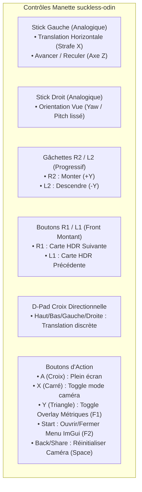

# 🎮 Guide d'Intégration & d'Utilisation des Manettes (Gamepad / Contrôleurs USB)

**Projet** : `suckless-odin`  
**Cibles Matérielles** : Sony DualShock 4 (PS4), DualSense (PS5), Logitech F310 / F710, Xbox 360 / One / Series X|S, Steam Controller  
**Date** : 21 Août 2026  
**Subsystem** : [`src/app/gamepad.odin`](../src/app/gamepad.odin), [`src/camera/camera.odin`](../src/camera/camera.odin)  

---

## 📑 Table des Matières

1. [Matériels Supportés & Philosophie d'Intégration](#1-matériels-supportés--philosophie-dintégration)
2. [Disposition des Contrôles & Grille de Mapping](#2-disposition-des-contrôles--grille-de-mapping)
3. [Architecture Logicielle & Détails d'Implémentation](#3-architecture-logicielle--détails-dimplémentation)
   * [3.1. Détection Hotplug & État de Connexion](#31-détection-hotplug--état-de-connexion)
   * [3.2. Filtrage Deadzone & Normalisation](#32-filtrage-deadzone--normalisation)
   * [3.3. Détection de Front Montant (Edge-Triggered Actions)](#33-détection-de-front-montant-edge-triggered-actions)
   * [3.4. Intégration dans la Physique Caméra & Non-Interférence Clavier](#34-intégration-dans-la-physique-caméra--non-interférence-clavier)
4. [Diagnostics Console & Tests Unitaires](#4-diagnostics-console--tests-unitaires)

---

<a id="1-matériels-supportés--philosophie-dintégration"></a>
## 1. 🕹️ Matériels Supportés & Philosophie d'Intégration

Le moteur `suckless-odin` intègre une couche de contrôle manette native s'appuyant sur l'API Gamepad standard de GLFW (`vendor:glfw`).

### Contrôleurs validés :
* **Sony DualShock 4 (PS4)** & **DualSense (PS5)** (connexion USB ou Bluetooth).
* **Logitech F310 / F710** (mode XInput recommandé avec switch sur **X**, ou mode DirectInput).
* **Microsoft Xbox 360 / One / Series X|S** (XInput standard).
* **Steam Deck / Steam Virtual Gamepad** (sous Proton ou Linux natif).

Le mapping suit la disposition canonique standard (ABXY / Croix-Rond-Carré-Triangle) avec support complet des axes analogiques (sticks et gâchettes L2/R2) et des boutons numériques.

---

<a id="2-disposition-des-contrôles--grille-de-mapping"></a>
## 2. 🗺️ Disposition des Contrôles & Grille de Mapping



### Grille de Correspondance Exhaustive :

| Contrôle Manette | Bouton / Axe GLFW | Action dans `suckless-odin` | Équivalent Clavier / Souris |
| :--- | :--- | :--- | :--- |
| **Stick Gauche (X)** | `GAMEPAD_AXIS_LEFT_X` | Strafe latéral gauche / droite (analogique lissé) | Touches `A` / `D` |
| **Stick Gauche (Y)** | `GAMEPAD_AXIS_LEFT_Y` | Avancer / Reculer dans l'axe de visée | Touches `W` / `S` |
| **Stick Droit (X)** | `GAMEPAD_AXIS_RIGHT_X` | Rotation horizontale de la caméra (Yaw $140^\circ/\text{s}$) | Déplacement horizontal souris |
| **Stick Droit (Y)** | `GAMEPAD_AXIS_RIGHT_Y` | Rotation verticale de la caméra (Pitch $-89^\circ \leftrightarrow +89^\circ$) | Déplacement vertical souris |
| **Gâchette R2** | `GAMEPAD_AXIS_RIGHT_TRIGGER` | Monter verticalement ($+Y$) proportionnellement à la pression | Touche `Q` |
| **Gâchette L2** | `GAMEPAD_AXIS_LEFT_TRIGGER` | Descendre verticalement ($-Y$) proportionnellement à la pression | Touche `E` |
| **D-Pad (Haut/Bas/G/D)** | `GAMEPAD_BUTTON_DPAD_*` | Déplacements directionnels discrets | Touches `W`/`S`/`A`/`D` |
| **Bumper Droit (R1)** | `GAMEPAD_BUTTON_RIGHT_BUMPER` | Passer à la map HDR suivante (+1) | Touche `Page Down` |
| **Bumper Gauche (L1)** | `GAMEPAD_BUTTON_LEFT_BUMPER` | Revenir à la map HDR précédente (-1) | Touche `Page Up` |
| **Start / Options** | `GAMEPAD_BUTTON_START` | Ouvrir / Fermer le panneau Dear ImGui | Touche `F2` |
| **Back / Share / Select** | `GAMEPAD_BUTTON_BACK` | Réinitialiser la caméra (position et orientation) | Touche `Space` |
| **Bouton Y (Triangle)** | `GAMEPAD_BUTTON_Y` | Cycle d'affichage de l'overlay texte (FPS / Timings / Off) | Touche `F1` |
| **Bouton X (Carré)** | `GAMEPAD_BUTTON_X` | Verrouiller / Libérer l'orientation caméra | Touche `C` |
| **Bouton A (Croix)** | `GAMEPAD_BUTTON_A` | Basculer en mode Plein Écran / Fenêtré | Touche `F` |

---

<a id="3-architecture-logicielle--détails-dimplémentation"></a>
## 3. 🏗️ Architecture Logicielle & Détails d'Implémentation

L'implémentation est centralisée dans [`src/app/gamepad.odin`](../src/app/gamepad.odin) et découplée de la boucle graphique.

<a id="31-détection-hotplug--état-de-connexion"></a>
### 3.1. Détection Hotplug & État de Connexion
À chaque trame, `gamepad_poll` vérifie si une manette compatible est présente sur l'ID joystick principal :
```odin
was_connected := state.connected
state.connected = bool(glfw.JoystickIsGamepad(state.joystick_id))

if state.connected && !was_connected {
    name := glfw.GetGamepadName(state.joystick_id)
    log.log_info("suckless-odin.gamepad", "Gamepad connected: %s (ID=%d)", name, state.joystick_id)
} else if !state.connected && was_connected {
    log.log_info("suckless-odin.gamepad", "Gamepad disconnected (ID=%d)", state.joystick_id)
}
```

<a id="32-filtrage-deadzone--normalisation"></a>
### 3.2. Filtrage Deadzone & Normalisation
Pour éliminer le tremblement (*stick drift*) des potentiomètres analogiques, une zone morte matérielle ($15\%$) est appliquée avec remise à l'échelle continue :
```odin
gamepad_apply_deadzone :: proc(value, deadzone: f32) -> f32 {
    abs_val := math.abs(value)
    if abs_val < deadzone {
        return 0.0
    }
    sign: f32 = 1.0 if value > 0.0 else -1.0
    return sign * (abs_val - deadzone) / (1.0 - deadzone)
}
```
Les gâchettes matérielles (qui oscillent entre $[-1, 1]$ sous GLFW) sont remappées dans $[0, 1]$ :
```odin
trig_norm := (pad.axes[glfw.GAMEPAD_AXIS_RIGHT_TRIGGER] + 1.0) * 0.5
```

<a id="33-détection-de-front-montant-edge-triggered-actions"></a>
### 3.3. Détection de Front Montant (Edge-Triggered Actions)
Pour les actions discrètes (changement d'environnement HDR, toggle du menu ImGui, switch plein écran), les transitions d'état sont détectées via un historique du buffer précédent :
```odin
btn_r1_now := pad.buttons[glfw.GAMEPAD_BUTTON_RIGHT_BUMPER]
btn_r1_prev := state.prev_buttons[glfw.GAMEPAD_BUTTON_RIGHT_BUMPER]
if btn_r1_now != 0 && btn_r1_prev == 0 {
    scene.scene_cycle_env(&application.scene, 1)
}
```

<a id="34-intégration-dans-la-physique-caméra--non-interférence-clavier"></a>
### 3.4. Intégration dans la Physique Caméra & Non-Interférence Clavier
Dans [`src/camera/camera.odin`](../src/camera/camera.odin), le sous-système clavier n'écrase plus le vecteur `move_input` s'il est au repos :
```odin
build_keyboard_input :: proc(cam: ^Camera) {
    kb_x := f32(i32(cam.move_right_)  - i32(cam.move_left))
    kb_y := f32(i32(cam.move_up_)      - i32(cam.move_down))
    kb_z := f32(i32(cam.move_forward)  - i32(cam.move_backward))

    if kb_x != 0 || kb_y != 0 || kb_z != 0 {
        cam.move_input = mt.Vec3{kb_x, kb_y, kb_z}
    }
}
```
Ceci garantit une transition transparente entre le contrôle à la manette et les raccourcis clavier sans conflits ni saccades.

---

<a id="4-diagnostics-console--tests-unitaires"></a>
## 4. 🧪 Diagnostics Console & Tests Unitaires

### Journalisation Automatique :
Lors du branchement d'une manette en cours d'exécution :
```text
2026-08-21 12:15:30 [1234:1235] - suckless-odin.gamepad - INFO - Gamepad connected: Sony DualShock 4 (ID=0)
```

### Suite de Tests Dédiée :
La suite [`tests/test_gamepad.odin`](../tests/test_gamepad.odin) valide la linéarité mathématique du filtrage de zone morte :
```bash
task test-unit
```
* Validation du seuil strictly nul à l'intérieur de la zone morte $[-0.15, +0.15]$.
* Validation de la pleine amplitude ($1.0$) en butée mécanique.
* Validation de la continuité au point médian ($0.575 \rightarrow 0.5$).
