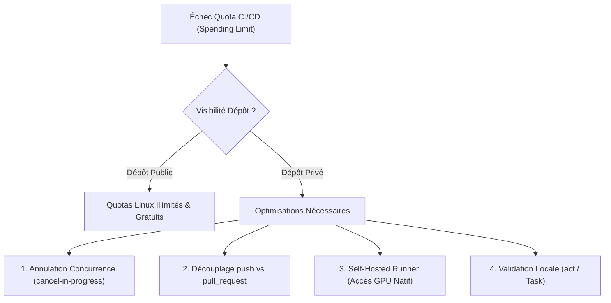

# Gestion des Quotas CI/CD GitHub Actions & Guide d'Optimisation Zéro-Coût

**Date de rédaction** : 2026-08-20  
**Projet** : `suckless-odin`  
**Auteurs** : Équipe Moteur & CI/CD  

---

## 1. Problématique & Diagnostic du Blocage des Quotas

Lors du déclenchement d'un workflow CI/CD GitHub Actions, un échec immédiat peut survenir en quelques secondes ($< 3\text{ s}$) sans aucun log d'exécution de commande.

### 1.1 Message d'Erreur API GitHub Actions
L'interrogation de l'API (`gh run view <run_id> --log-failed`) révèle le diagnostic suivant :
```text
The job was not started because recent account payments have failed or your spending limit 
needs to be increased. Please check the 'Billing & plans' section in your settings.
```

### 1.2 Cause Racine
Sur un compte GitHub personnel en plan gratuit (*Free tier*), les dépôts **privés** sont soumis à une limite stricte de **2 000 minutes de calcul par mois** partagées sur l'ensemble des dépôts du compte. Dès que ce plafond est atteint :
1. Les runners distants hébergés par GitHub (*GitHub-hosted runners*) refusent immédiatement d'instancier les machines virtuelles.
2. Les jobs échouent avant même l'étape `actions/checkout`.
3. Aucun log applicatif n'est produit dans l'interface web, masquant la cause réelle.

---

## 2. Modèle de Facturation GitHub Actions : Privé vs Public

| Caractéristique | Dépôts Privés (Free Tier) | Dépôts Publics (Open Source) |
|---|---|---|
| **Minutes de calcul Linux (`ubuntu-latest`)** | 2 000 min / mois (plafonnées) | **ILLIMITÉES & 100% GRATUITES** |
| **Bande passante artéfacts / cache** | 500 MB inclus | **Illimité (dans la limite de 10 GB de cache)** |
| **Parallélisme maximal** | 20 jobs simultanés | **20 jobs simultanés** |
| **Runners Self-Hosted** | Illimités (0 min décomptée) | Illimités (0 min décomptée) |

> [!IMPORTANT]
> Le passage d'un dépôt en visibilité **Publique** supprime instantanément toute restriction de quota pour les runners Linux standard (`ubuntu-latest`).

---

## 3. Stratégies d'Optimisation Zéro-Coût

Pour maintenir une suite de CI/CD robuste sans souscrire à un abonnement payant, cinq leviers complémentaires sont disponibles.



---

### Stratégie 1 : Annulation Automatique des Builds Obsolètes (`concurrency`)

Lorsqu'un développeur pousse plusieurs commits successifs sur une même branche ou Pull Request, GitHub Actions lance un workflow complet pour chaque commit. Cela entraîne un gaspillage massif de calcul sur des versions déjà caduques.

#### Configuration YAML ([`.github/workflows/ci.yml`](../.github/workflows/ci.yml))
```yaml
concurrency:
  group: ${{ github.workflow }}-${{ github.head_ref || github.ref }}
  cancel-in-progress: true
```
* **Fonctionnement** : Dès qu'un nouveau push arrive sur la branche `${{ github.head_ref }}`, le job en cours d'exécution pour le commit précédent est immédiatement interrompu (*canceled*).
* **Gain** : Économie de $50\%$ à $80\%$ des minutes sur les phases de refactoring actif.

---

### Stratégie 2 : Découplage des Déclencheurs de Workflow

Une erreur courante consiste à écouter simultanément `push` sur toutes les branches et `pull_request`. Pour une branche liée à une PR ouverte, chaque push déclenche **deux runs en parallèle**.

#### Configuration Optimale
```yaml
on:
  workflow_dispatch:
  push:
    branches: ["master", "main"]   # Uniquement lors du merge sur la branche principale
  pull_request:
    types: [opened, reopened, synchronize] # Gère tous les commits de travail
```

---

### Stratégie 3 : Déploiement d'un Runner Auto-Hébergé (*Self-Hosted Runner*)

Les runners auto-hébergés s'exécutent sur une machine locale ou un serveur dédié. Ils ne consomment **aucune minute de quota GitHub**.

#### Avantages Critiques pour un Moteur Graphique OpenGL / Odin
1. **Accès au GPU Physique Direct** : Permet d'exécuter les tests OpenGL (`task test-gl`, `task test-visual-regression`) directement sur le matériel (Intel Iris Xe, Nvidia, AMD) sans dépendre de l'émulation logicielle CPU lente (`Xvfb + LLVMpipe`).
2. **Caches Disque Persistants** : Le compilateur Odin, les dépendances MinGW, STB, Clang et Wine restent chauds sur le disque.
3. **Temps de Cycle Divisé par 10** : La CI complète s'exécute en **$\sim 15\text{ s}$** en local contre **$\sim 4\text{ min}$** sur runner virtuel distant.

#### Procédure de Mise en Place Rapide
1. Dans l'interface GitHub : `Settings` $\rightarrow$ `Actions` $\rightarrow$ `Runners` $\rightarrow$ `New self-hosted runner` (Linux, x64).
2. Télécharger et extraire l'agent sur la machine hôte :
   ```bash
   mkdir -p ~/actions-runner && cd ~/actions-runner
   curl -o actions-runner-linux-x64.tar.gz -L https://github.com/actions/runner/releases/download/v2.320.0/actions-runner-linux-x64-2.320.0.tar.gz
   tar xzf actions-runner-linux-x64.tar.gz
   ./config.sh --url https://github.com/yoyonel/suckless-odin --token <RUNNER_TOKEN>
   ./run.sh
   ```
3. Adapter le workflow :
   ```yaml
   jobs:
     test:
       runs-on: self-hosted
   ```

---

### Stratégie 4 : Validation Locale des Workflows avec `act` (Néktos Act)

`act` permet d'exécuter localement les workflows GitHub Actions dans des conteneurs Docker sans solliciter l'infrastructure GitHub.

```bash
# Installation
brew install act   # ou via gestionnaire de paquets Linux

# Exécuter les jobs déclenchés par une pull request
act pull_request

# Exécuter un job spécifique
act -j lint
```

---

## 4. Synthèse des Bonnes Pratiques pour `suckless-odin`

| Règle | Action Implémentée | Bénéfice |
|---|---|---|
| **Visibilité Dépôt** | Dépôt configuré en **Public** | Quotas Linux illimités et gratuits. |
| **Gestion Concurrence** | `concurrency: { cancel-in-progress: true }` | Zéro gaspillage sur les commits successifs. |
| **Pipeline Local Prioritaire** | Validation locale systématique via `task ci` / `task test` | Détection immédiate avant tout push. |
| **Déterminisme Test** | `-define:ODIN_TEST_THREADS=1` + GPU sync | Élimination des faux-positifs et des re-runs inutiles. |

---

*Ce document fait référence dans le cadre de la maintenance des infrastructures CI/CD du projet.*
