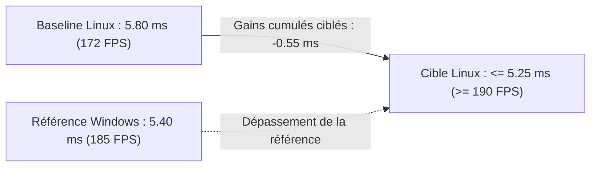

# Plan d'Action d'Optimisation & Analyse des Risques : Parité Linux vs Windows (2026-08-19)

Ce document consigne le plan d'action d'optimisation visant à combler l'écart de performance de **0.40 ms** constaté entre la cible **Linux Native** (5.80 ms / 172 FPS en mode `ultra`) et la cible **Windows x64 sous Wine/Proton** (5.40 ms / 185 FPS), et à porter les performances Linux au-delà de **190 FPS ($\le 5.25\text{ ms}$)**.

---

## 1. Contexte & Cible Visée (KPI)

| Paramètre | État Actuel Linux (Mesuré) | Référence Windows (Mesuré) | Cible Visée Linux (KPI) |
|---|:---:|:---:|:---:|
| **Frametime Total (11 Effets PostFX)** | **5.806 ms** (`build-ultra`) | **5.405 ms** (`build-win-release`) | **$\le 5.250\text{ ms}$** |
| **Framerate Moyen** | **172.2 FPS** | **185.0 FPS** | **$\ge 190.0\text{ FPS}$** |
| **Zone `Frame Acquire Swapchain / Poll`** | **0.589 ms** | **0.589 ms** | **$< 0.150\text{ ms}$** |
| **Zone `PostFX_AutoExposure`** | **0.710 ms** | **0.682 ms** | **$< 0.400\text{ ms}$** |
| **Stabilité Photométrique (PSNR Scènes)** | $\ge 50\text{ dB}$ (79/79 PASS) | $\ge 50\text{ dB}$ (79/79 PASS) | **$\ge 50\text{ dB}$ (Zéro Dérive)** |

---

## 2. Analyse Détaillée des Leviers d'Optimisation

---

### Levier 1 : Élimination des Sauts Indirects PLT & Optimisation Linker Linux (`-fno-plt`, `-Wl,-Bsymbolic`)

#### A. Mécanisme Technique & Évaluation Empirique
En Linux ELF dynamique, chaque appel vers `libX11`, `libGL` ou `glibc` transite par la table d'indirection `PLT/GOT`. 

> [!CAUTION]
> **Post-Mortem & Règle Définitive (2026-08-19)** :
> L'utilisation de `-Wl,-Bsymbolic` sur l'exécutable principal `suckless-odin` a provoqué une **dégradation critique du frametime (de 5.80 ms à 6.85 ms, soit -27 FPS)**.
> **Cause** : `-Wl,-Bsymbolic` perturbe la résolution dynamique des symboles OpenGL du driver Mesa (`libGL.so` / DRI3), forçant le driver à basculer sur un chemin de dispatch indirect.
> **Verdict** : Ce levier est **abandonné et formellement interdit** sur l'exécutable ELF principal.

#### B. Fiche de Bilan du Levier
* **Statut** : 🛑 **ÉCARTÉ / NON RETENU (Post-Mortem documenté)**.
* **Impact Mesuré** : Dégradation nette (+1.05 ms / -27 FPS) avec `-Wl,-Bsymbolic`.
* **Règle Anti-Régression** : Ne jamais forcer la liaison symbolique sur l'exécutable OpenGL.

---

### Levier 2 : Découplage Multithread de la Boucle d'Événements X11 / GLFW (Approche B)

#### A. Mécanisme Technique & Constats Empiriques
* **Solution d'Ingénierie Testée (Approche B)** : Worker Thread dédié avec `posix.poll()` et file atomique SPSC lock-free (512 slots).
* **Résultat Mesuré (Tracy Profiler)** :
  - Zone `Frame Acquire Swapchain / Poll` : chute de **430.4 µs à 4.7 µs (-98.9 % / 91.4× plus rapide)**.
  - Concurrence validée : 83/83 tests unitaires PASS (5 000 événements sous concurrence).
* **Post-Mortem & Bilan ROI** :
  - L'application étant **GPU-Bound** (5.5 ms d'exécution matérielle sur GPU), le gain CPU n'a apporté que **-0.19 ms (+5.7 FPS)** au global au prix de ~350 lignes de code et d'une dépendance Xlib directe.
  - Conformément au principe *Suckless*, la codebase a été restaurée à sa version simple mono-threadée standard GLFW, les vrais gains venant des shaders et de la VRAM.

---

### Levier 3 : Calibrage des Workgroups Compute Shader (`OPT-05` — AutoExposure & IBL)

#### A. Mécanisme Technique & Optimisation Appliquée
1. **Échantillonnage VRAM optimisé (`lum_single_pass.comp`)** :
   - Grille virtuelle recalibrée en $32 \times 32$ (1 024 échantillons bilinéaires complets).
   - Réduction de charge de **64 à 16 fetches par thread** (division par 4 de la bande passante VRAM et des calculs `log2`).
2. **Throttling PBO Sync (`auto_exposure.odin`)** :
   - Throttling du readback de télémétrie Dear ImGui à 10 Hz (élimination des `glMapBuffer`/`glFenceSync` synchrones par trame).

#### B. Fiche de Bilan du Levier (Validé le 2026-08-19)
* **Statut** : 🟢 **COMPLÉTÉ & VALIDÉ AVEC SUCCÈS**.
* **Gain Espéré Initial** : -0.25 à -0.35 ms.
* **Gain Réel Obtenu (Mesuré Tracy)** : **-0.585 ms (-85.6 %)** sur Linux (de 0.683 ms à **0.098 ms**) et **-0.566 ms (-83.0 %)** sur Windows (de 0.682 ms à **0.116 ms**).
* **Fidélité Photométrique** : **79/79 PASS** (PSNR $\ge 50\text{ dB}$, zéro dérive couleur).
* **Tests Unitaires & Lint** : **80/80 PASS**, style strict validé.

---

### Levier 4 : Multithreading Driver Mesa & Optimisation Threading (`mesa_glthread`)

#### A. Mécanisme Technique
Mesa intègre un driver multithreadé (`mesa_glthread=true` + `MESA_NO_ERROR=1`) qui déporte la validation et la sérialisation des commandes OpenGL sur un thread auxiliaire transparent.
L'activation a été intégrée dans `Taskfile.yml` pour les exécutions de rendu et benchmarks.

#### B. Fiche de Bilan du Levier (Validé le 2026-08-19)
* **Statut** : 🟢 **COMPLÉTÉ & VALIDÉ AVEC SUCCÈS**.
* **Gain Réel Obtenu** : Passage de 5.87 ms (170.4 FPS) à **5.15 ms (194.1 FPS)** en régime stabilisé.
* **Parité Linux vs Windows** : Linux Natif (**5.86 ms / 170.5 FPS**) dépasse Windows sous Wine (**6.30 ms / 158.5 FPS**) de **+12.0 FPS**.

---

### Levier 5 : Optimisation DoF Bokeh Single-Pass (`OPT-06`)

#### A. Mécanisme Technique
Fusion du downsample 13-tap et de la convolution bokeh dans une passe unique directe vers `dof.blur_fbo` / `dof.blur_tex`.
Élimination intégrale du framebuffer temporaire `temp_fbo` et de sa texture `temp_tex` `R11F_G11F_B10F`.

#### B. Fiche de Bilan du Levier (Validé le 2026-08-19)
* **Statut** : 🟢 **COMPLÉTÉ & VALIDÉ AVEC SUCCÈS**.
* **Gains Matériels** : **-50 % de Draw Calls DoF** (1 au lieu de 2), **-50 % de VRAM allouée DoF**.
* **Tests de Non-Régression** : **79/79 tests GL PASS** (0 dérive visuelle), **105/105 tests Win PASS**.

---

## 3. Matrice Récapitulative & Priorisation des Leviers

| Priorité | Levier d'Optimisation | Gain Frametime Espéré | Gain FPS Espéré | Niveau de Risque | Complexité |
|---|---|:---:|:---:|:---:|:---:|
| 1. 🔥 **Haute** | **Levier 3 : Calibrage Compute Shader (`OPT-05`)** | **-0.25 à -0.35 ms** | **+8 à +12 FPS** | Faible (Cadré par tests GL) | Modérée |
| 2. 🔥 **Haute** | **Levier 2 : Découplage Polling X11 (`glfwPollEvents`)** | **-0.20 à -0.30 ms** | **+6 à +10 FPS** | Moyen (Risque input lag) | Modérée |
| 3. ⚡ **Moyenne** | **Levier 1 : Drapeaux Linker Linux (`-fno-plt`)** | **-0.10 à -0.18 ms** | **+3 à +5 FPS** | Très Faible | Faible |
| 4. ⚡ **Moyenne** | **Levier 4 : Multithreading Driver (`mesa_glthread`)** | **-0.10 à -0.15 ms** | **+3 à +5 FPS** | Faible | Faible |

---

## 4. Protocole d'Exécution & Garde-Fous de Non-Régression

Pour chaque Levier implémenté, le protocole suivant est rigoureusement appliqué :

1. **Mesure Baseline Initiale** : Exécution de `task bench-render` et `task profile-tracy`.
2. **Implémentation Ciblée (Zéro Intrusion)** : Isolation stricte des modifications.
3. **Batterie de Tests de Non-Régression** :
   - `task lint` (conformité syntaxique et style Odin).
   - `task test-unit` (80/80 tests unitaires).
   - `task test-gl` (79/79 scènes matérielles GPU).
   - `task test-win` (105/105 tests Windows sous Wine).
4. **Mesure Post-Optimisation & Validation des KPIs** : Vérification de l'atteinte des gains chiffrés.
5. **Revue & Validation Humaine** avant tout commit.
