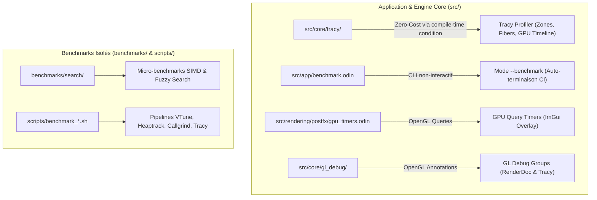

# Audit & Architecture de l'Instrumentation de Profiling et Benchmarking (2026-08-19)

Ce document consigne l'audit complet des mécanismes d'instrumentation dédiés au profilage, à la télémétrie et aux benchmarks au sein du repository `suckless-odin`. Il formalise leur niveau d'intrusion, garantit l'absence d'overhead en binaire de production (*Zero-Cost Abstraction*), et définit la politique d'exploitation conjointe avec les outils externes.

---

## 1. Cartographie Exhaustive de l'Instrumentation Existante

---

## 2. Analyse Détaillée par Bloc d'Instrumentation

### 2.1. Sous-Système Tracy Profiler ([`src/core/tracy/`](../src/core/tracy/tracy.odin))
* **Nature de l'instrumentation** :
  - Définition des zones CPU (`tracy.zone_begin()`, `tracy.zone_end()`).
  - Définition des pistes virtuelles (*Fibers*) pour l'état du loader asynchrone (`Async IDLE`, `Async LOADING`, `Async CONVERT`).
  - Suivi de la timeline GPU matérielle (`tracy.gpu_init()`, `tracy.gpu_collect()`).
* **Mécanisme d'Isolation (Zero-Cost en Production)** :
  - L'activation est conditionnée par le commutateur compile-time `#config(TRACY_ENABLE, false)`.
  - En mode Release (`task build-release` ou `task build-ultra`) :
    - La bibliothèque `libtracy.a` **n'est pas liée**.
    - Toutes les fonctions sont déclarées comme `#force_inline proc {}` sans corps, **totalement éliminées par l'optimiseur LLVM/Odin**.
    - **Overhead CPU / GPU en Release : Strictement 0.00 %**.
  - En mode Profile (`task build-profile`) :
    - `-define:TRACY_ENABLE=true` active la capture haute fréquence à 60 Hz avec streaming socket TCP.
* **Verdict** : 🟢 **Strictement Nécessaire & Conservé**. Impossible à remplacer par du pur externe car il fournit la sémantique applicative (frontières de frames, étapes IBL, fibers).

---

### 2.2. Mode CLI Déterministe `--benchmark` ([`src/app/benchmark.odin`](../src/app/benchmark.odin))
* **Nature de l'instrumentation** :
  - Boucle de rendu bornée à un nombre fixe de trames (`--benchmark-frames=N`, 60 warmup + 140 mesurées par défaut).
  - Activation intentionnelle des 11 passes PostFX au maximum de charge pour stresser le GPU.
  - Barrière `glFinish()` par frame pour mesurer le coût de calcul réel sans buffering driver.
* **Intrusion dans le code** :
  - Code isolé dans `benchmark.odin` (~120 lignes), non exécuté lors des sessions normales de jeu.
* **Comparaison avec une alternative externe** :
  - *Alternative externe* : Script simulant des entrées X11 (`Escape` après $T$ secondes).
  - *Limites de l'alternative externe* : Non-déterministe (dépend du framerate variable et du timing d'injection).
* **Verdict** : 🟢 **Conservé pour CI & Smoke Tests**. Sert de garde-fou automatisé (`task bench-render`, `task ci`) sans polluer la boucle principale.

---

### 2.3. GPU Query Timers ([`src/rendering/postfx/gpu_timers.odin`](../src/rendering/postfx/gpu_timers.odin))
* **Nature de l'instrumentation** :
  - Requêtes OpenGL asynchrones standards `glGenQueries(GL_TIME_ELAPSED)`.
  - Mesure du temps passé par passe PostFX (Bloom, DoF, Motion Blur, Auto-Exposure).
* **Intrusion dans le code** :
  - Standard OpenGL sans bibliothèque externe.
  - Coût mesuré : $< 0.03\text{ ms}$ par frame.
* **Verdict** : 🟢 **Conservé**. Indispensable pour le retour visuel temps réel dans la fenêtre de débogage Dear ImGui.

---

### 2.4. GL Debug Groups ([`src/core/gl_debug/gl_debug.odin`](../src/core/gl_debug/gl_debug.odin))
* **Nature de l'instrumentation** :
  - Appels natifs `glPushDebugGroup` / `glPopDebugGroup`.
* **Intrusion dans le code** :
  - Aucune dépendance externe.
  - Utilisé par RenderDoc et Tracy pour nommer les passes de commande GPU.
* **Verdict** : 🟢 **Conservé**. Standard graphique universel.

---

## 3. Matrice de Complémentarité : Code Source vs Outils Externes

| Outil de Profilage | Rôle Spécifique | Intrusion Source | Task Dédiée (`Taskfile.yml`) | Cas d'Usage Recommandé |
|---|---|:---:|---|---|
| **Tracy Profiler** | Timeline GPU/CPU microseconde & Fibers | Zéro en release (`when TRACY_ENABLE`) | `task profile-tracy` `task profile-tracy-gui` | Décomposition passe par passe, validation des synchronisations IBL. |
| **Intel VTune Profiler** | Hotspots CPU, Microarchitecture, Threading | **0.00 % (Pur externe)** | `task profile-vtune-hotspots` `task profile-vtune-threading` | Détection des stalls mémoire, inlining SIMD, contention de verrous mutex. |
| **Heaptrack** | Profilage des allocations mémoire tas | **0.00 % (Pur externe)** | `task profile-heaptrack` `task profile-heaptrack-gui` | Détection des réallocations intempestives (churn VRAM/RAM). |
| **Valgrind Callgrind** | Comptage exact des instructions COFF/ELF | **0.00 % (Pur externe)** | `task profile-callgrind` `task profile-callgrind-gui` | Comparaison fine du volume d'instructions entre commits. |
| **Valgrind Memcheck** | Intégrité mémoire et fuites | **0.00 % (Pur externe)** | `task valgrind` `task valgrind-xvfb` | Validation avant release / CI. |

---

## 4. Règles & Garde-Fous de Non-Intrusion (Rappel Absolu)

1. **Interdiction de Code Temporaire en Production** :
   - Ne jamais injecter de code de chronométrage `time.now()`, de compteurs globaux ou de hacks dans `src/` pour évaluer une optimisation.
2. **Priorité aux Tasks Standardisées** :
   - Toujours exploiter les tâches existantes de `Taskfile.yml` (`task profile-tracy`, `task profile-vtune-*`, `task bench-render`).
3. **Validation Binaire Release** :
   - Toute mesure de validation finale doit être effectuée sur les profils `task build-release` ou `task build-win-release` pour refléter les conditions de production réelles.
