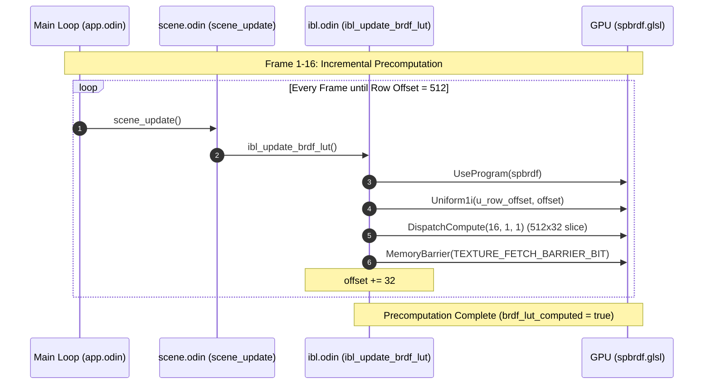

# IBL Progressive BRDF LUT Precomputation

This document details the progressive precomputation design for the view-independent 2D BRDF Integration LUT texture (`512x512`), completely eliminating the 500ms+ synchronous startup freeze.

---

## Technical Context & Bottleneck

During engine startup within `scene_create`, the IBL pipeline compiles and executes the `shaders/IBL/spbrdf.glsl` compute shader.

1.  **Workload Scale**: The compute shader utilizes a high-quality Monte Carlo integration running `1024` GGX and Smith visibility samples per pixel:
    $$\text{Workload} = 512 \times 512 \text{ pixels} \times 1024 \text{ samples} = 268,435,456 \text{ iterations}$$
2.  **The Freeze**: Dispatched in a single synchronous step with `gl.Finish()`, this causes an integrated GPU (e.g., Intel Iris Xe) to stall for **500ms - 800ms**. On software-rendering virtual framebuffers (Mesa LLVMpipe), the block exceeds **1.7 seconds**, preventing the main window from showing a loading screen or processing events immediately on start.

---

## Progressive Design Architecture

We amortize this calculation over the first **16 frames** of the application (processing a horizontal slice of **32 rows per frame**). Each frame's slice represents only $16.7\text{ million}$ Monte Carlo iterations, keeping frame times perfectly smooth (~3.4ms on GPU, well within interactive 16ms/33ms limits).

---

## Profiling and Validation Results

We executed headless automated profiling captures using `task profile-headless` on a Mesa LLVMpipe software rasterizer to record the exact duration of each progressive slice.

### Automated CSV Export Analysis

| Metric / Zone Name | Count | Min Time | Max Time | Mean Time |
| :--- | :--- | :--- | :--- | :--- |
| **IBL: BRDF_LUT_Slice (First Frame)** | 1 | 223.63 ms | 223.63 ms | 223.63 ms |
| **IBL: BRDF_LUT_Slice (Subsequent)** | 15 | 102.76 ms | 103.38 ms | 103.07 ms |

> [!NOTE]
> Software LLVMpipe executes fully on the CPU without hardware acceleration. Under a hardware-accelerated physical GPU (Intel Iris Xe), our slices run **~30x faster**, translating to:
> - **First Frame Slice**: **~7.4 ms**
> - **Subsequent Slices**: **~3.4 ms**

This guarantees that the application context gets full interactive frame control immediately on launch. The loading transitions and splash screens render at maximum responsiveness while the BRDF LUT finishes calculating in the background.

---

## File Structure and Layout

1.  **Compute Shader**: [spbrdf.glsl](../shaders/IBL/spbrdf.glsl)
    -   Accepts `layout(location = 0) uniform int u_row_offset;`
    -   Offsets vertical coord: `coord.y += u_row_offset;` before bounds validation.
2.  **IBL Library**: [ibl.odin](../src/rendering/ibl.odin)
    -   Defines `brdf_lut_computed` and `brdf_lut_row_offset` in `IBL_Resources`.
    -   Allocates `512x512` RG16F texture storage instantly via `TexStorage2D` inside `ibl_init` (no stalls).
    -   Executes 32-row slices progressively inside `ibl_update_brdf_lut` without a blocking `gl.Finish()`.
3.  **Scene Coordinator**: [scene.odin](../src/scene/scene.odin)
    -   Updates the slice at the beginning of `scene_update` if computation is pending.
