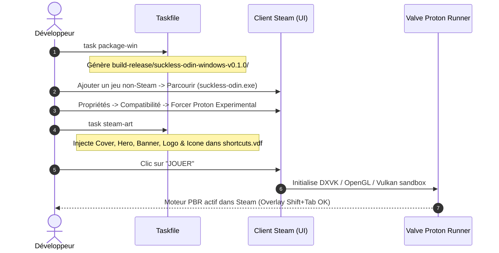

# Guide d'Intégration Steam, Proton et Déploiement Non-Steam

Ce guide documente la procédure complète pour intégrer, configurer et exécuter `suckless-odin` comme jeu non-Steam sous Linux avec le runtime officiel Valve Proton (Flatpak ou Natif), ainsi que le cycle de mise à jour rapide du binaire.

---

## 1. Vue d'Ensemble du Flux



---

## 2. Installation Initiale dans la Bibliothèque Steam

### Étape 1 : Générer le paquet autonome de release
Construit l'exécutable Windows `.exe` optimisé et synchronise les shaders GLSL et les textures HDR :

```bash
task package-win
```

* **Dossier produit** : `build-release/suckless-odin-windows-v0.1.0/`
* **Exécutable cible** : `build-release/suckless-odin-windows-v0.1.0/suckless-odin.exe`

> [!NOTE]
> **Si Steam tourne sous Flatpak** (cas par défaut sous Fedora / Bazzite / Ubuntu Flatpak), autorisez Steam à lire votre dossier de développement :
> ```bash
> flatpak override --user --filesystem="$HOME/Prog" com.valvesoftware.Steam
> ```

---

### Étape 2 : Ajouter l'exécutable dans la bibliothèque Steam
1. Ouvrez l'application **Steam**.
2. En bas à gauche, cliquez sur **`+ AJOUTER UN JEU`** $\rightarrow$ **`Ajouter un jeu non-Steam...`**.
3. Cliquez sur le bouton **`Parcourir...`**.
4. Sélectionnez le fichier `suckless-odin.exe` dans votre dossier de release :
   ```text
   <CHEMIN_DU_PROJET>/build-release/suckless-odin-windows-v0.1.0/suckless-odin.exe
   ```
5. Cochez la case devant `suckless-odin.exe` et cliquez sur **`AJOUTER LES SÉLECTIONS`**.

---

### Étape 3 : Configurer Proton (Couche de compatibilité)
1. Dans votre bibliothèque Steam, faites un **clic-droit sur `suckless-odin.exe`** $\rightarrow$ **`Propriétés...`**.
2. Dans l'onglet **`Compatibilité`** :
   - Cochez **`Forcer l'utilisation d'un outil de compatibilité Steam Play spécifique`**.
   - Sélectionnez **`Proton - Experimental`** (ou `Proton 9.0`).
3. Dans l'onglet **`Raccourci`** :
   - Vérifiez que le champ **`Dossier de départ`** pointe bien vers le dossier parent du `.exe` (afin de charger `shaders/` et `assets/`) :
     ```text
     "<CHEMIN_DU_PROJET>/build-release/suckless-odin-windows-v0.1.0"
     ```

---

### Étape 4 : Injecter automatiquement les visuels Steam Grid
1. **Quittez complètement Steam** (clic-droit sur l'icône Steam de la barre des tâches $\rightarrow$ `Quitter Steam`).
2. Exécutez l'injection automatisée des visuels et de l'icône :
   ```bash
   task steam-art
   ```
3. **Relancez Steam** : la fiche de jeu affiche automatiquement la couverture HD verticale (Cover 600×900), la bannière (Hero 1920×620), la capsule (Banner 460×215), le logo transparent et l'icône de l'application.

---

### Étape 5 : Lancement et Validation
1. Cliquez sur le bouton vert **`JOUER`** dans Steam.
2. **Vérifications** :
   - **Overlay Steam** : `Maj + Tab` ouvre l'interface Steam en jeu.
   - **Rendu PBR & IBL** : Sphères Cook-Torrance et environnement HDR fluides (60 FPS+).
   - **Contrôles** : `Tab` (menu ImGui), `Page Up` / `Page Down` (changer d'environnement HDR), `F` (plein écran), `Échap` (fermeture propre).

---

## 3. Comment Mettre à Jour l'Application et Répercuter dans Steam ?

Lors du développement, après avoir modifié du code Odin (`src/`), des shaders (`shaders/`) ou des assets (`assets/`) :

### Commande unique de mise à jour :
```bash
task package-win
```

### Pourquoi cela se répercute instantanément dans Steam :
1. **Pointeur stable** : Le raccourci Steam pointe directement sur le fichier physique `<CHEMIN_DU_PROJET>/build-release/suckless-odin-windows-v0.1.0/suckless-odin.exe`.
2. **Recompilation & Sync automatique** :
   - `task package-win` recompile le binaire Windows optimisé (`build/release-win/suckless-odin.exe`).
   - `rsync --update` remplace instantanément l'exécutable ainsi que tous les shaders et assets modifiés dans `build-release/suckless-odin-windows-v0.1.0/`.
3. **Aucune reconfiguration Steam nécessaire** :
   - **Pas besoin de rouvrir les propriétés Steam ni de re-créer le raccourci**.
   - Cliquez simplement sur **`JOUER`** dans Steam : Proton exécutera directement la nouvelle version compilée.
