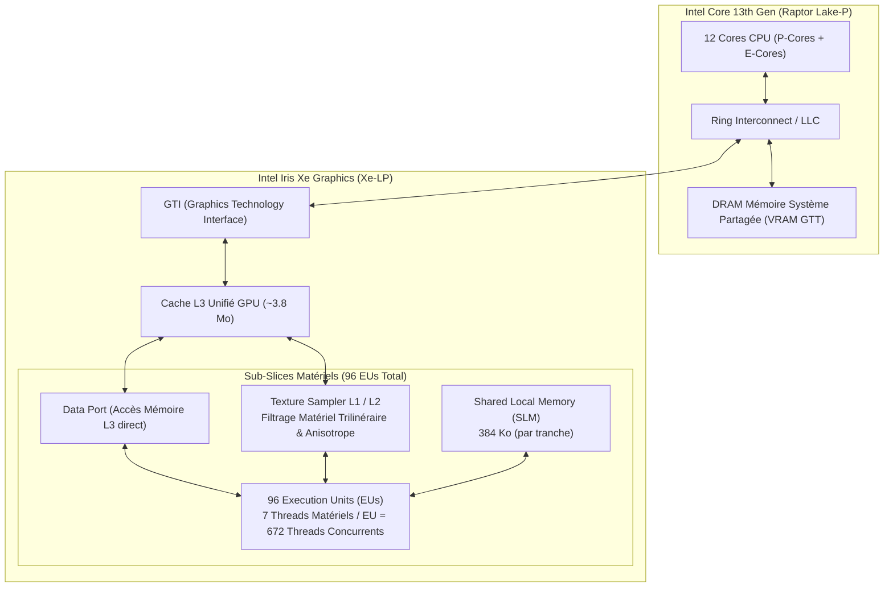

# 📘 Guide Complet & Tutoriel : Profilage GPU sous Intel VTune Profiler

**Projet** : `suckless-odin`  
**Cible Matérielle** : Intel® Iris® Xe Graphics (Gen12 / Raptor Lake-P, 96 Execution Units)  
**Traces Analysées** :
- `r016gpu_hs` : GPU Compute & Media Hotspots (Overview, EU Occupancy, Sampler)
- `r017gpu_mem` : GPU Global Memory Accesses (L3 Cache, SLM, DRAM Bandwidth)  
**Date** : 21 Août 2026  
**Auteur** : Équipe Moteur 3D & Profiling  

---

## 📑 Table des Matières

1. [Architecture GPU Intel Iris Xe & Notions Fondamentales](#1-architecture-gpu-intel-iris-xe-notions-fondamentales)
2. [Intégration de l'API Intel ITT & Collecte Ciblée](#2-integration-api-intel-itt)
3. [Analyse Écran par Écran de `r016gpu_hs` (GPU Hotspots & EUs)](#3-analyse-r016gpu_hs)
4. [Analyse Écran par Écran de `r017gpu_mem` (Mémoire Globale & Cache L3)](#4-analyse-r017gpu_mem)
   * [Écran 1 : Onglet `Summary` (Histogramme de Lecture & Débits VRAM)](#ecran-1-summary-r017gpu_mem)
   * [Écran 2 : Onglet `Graphics` (Timeline Mémoire, Cache L3 & Absence de Conflit SLM)](#ecran-2-graphics-r017gpu_mem)
   * [Écran 3 : Onglet `Platform` (Vue Hybride & Corrélation Débit / Tranches)](#ecran-3-platform-r017gpu_mem)
5. [Guide Méthodologique : Interpréter les Goulots d'Étranglement](#5-guide-methodologique-goulots)
6. [Comparatif des Types de Collecteurs VTune sous Linux (OpenGL vs SYCL/Level-Zero)](#6-comparatif-des-types-de-collecteurs-vtune-sous-linux-opengl-vs-sycllevel-zero)
7. [Références & Documentation Officielle Intel](#7-references-documentation-officielle-intel)

---

<a id="1-architecture-gpu-intel-iris-xe-notions-fondamentales"></a>
## 1. 🏛️ Architecture GPU Intel Iris Xe & Notions Fondamentales

Pour comprendre les métriques affichées par VTune, il est indispensable de connaître les composants clés du processeur graphique Intel Iris Xe (architecture Gen12 / Xe-LP) :



* **Execution Unit (EU)** : Cœur de calcul SIMD vectoriel. Notre GPU dispose de **96 EUs**, chacun capable d'exécuter jusqu'à **7 threads matériels simultanés**, soit **672 threads en vol** en continu.
* **EU Array Active** : Pourcentage du temps où les ALU effectuent des calculs mathématiques utiles (instructions FP32/FP16).
* **EU Array Stalled** : Pourcentage du temps où les threads matériels sont bloqués en attente de données (accès mémoire, latence de texture, dépendances de registres).
* **EU Array Idle** : Pourcentage du temps où aucun thread n'est assigné à l'EU (manque de parallélisme dans la grille de calcul).
* **Cache L3 GPU** : Cache ultra-rapide interne au GPU (~0.25 à 0.5 TB/s de bande passante). Il intercepte les accès répétitifs aux textures et buffers.
* **Shared Local Memory (SLM)** : Mémoire locale partagée ultra-rapide au niveau du workgroup.
* **Sampler Matériel** : Unité dédiée au décodage de formats, filtrage cubemap et échantillonnage de textures.

---

<a id="2-integration-api-intel-itt"></a>
## 2. ⚡ Intégration de l'API Intel ITT & Collecte Ciblée

Dans un moteur 3D interactif, un profilage continu capture des millions de trames inutiles (boucle d'initialisation, temps d'inactivité, présentation X11).

Notre implémentation ([`src/core/itt/itt.odin`](file:///home/latty/Prog/__PERSO__/suckless-odin/src/core/itt/itt.odin)) pilote dynamiquement VTune :
1. **Lancement en pause** : `vtune -collect gpu-hotspots -start-paused ...`
2. **Début IBL ([`src/scene/env_manager.odin`](file:///home/latty/Prog/__PERSO__/suckless-odin/src/scene/env_manager.odin#L403))** :
   ```odin
   itt.resume()
   itt.task_begin("IBL_Progressive_Pipeline")
   ```
3. **Fin IBL (`.Done`)** :
   ```odin
   itt.task_end()
   itt.pause()
   ```

Résultat : **Seules les phases de calcul IBL sont enregistrées.** Le régime permanent est ignoré, garantissant une trace 100% pure et sans bruit.

---

<a id="3-analyse-r016gpu_hs"></a>
## 3. 🔍 Analyse Écran par Écran de `r016gpu_hs` (GPU Hotspots & EUs)

### Écran 1 : Onglet `Summary` (Diagnostic Global & Histogramme Mémoire)


1. **`Elapsed Time` & `GPU Time`** :
   * `Elapsed Time: 27.180s` $\rightarrow$ Durée totale de la session de benchmark interactive.
   * `GPU Time: 3.438s (98.5% du temps actif)` $\rightarrow$ Le GPU a travaillé intensivement pendant 3.44 secondes au total (la somme exacte des 3 bakes IBL).
2. **`Bandwidth Utilization Histogram`** :
   * **Moyenne (9.3 GB/s)** : Débit moyen consommé par le moteur.
   * **Maximum Observé (~34 GB/s)** : Pic instantané lors des convolutions de mips volumineux.
   * Le bus mémoire DDR4/DDR5 partagé du CPU reste dans la zone verte **"Low"** ($< 35$ GB/s).

---

### Écran 2 : Onglet `Graphics` (Timeline Macro, Tâches ITT & Métriques EU)


1. **La Timeline Inférieure (Les 3 Blocs Temporels)** :
   * Alternance nette entre zones `paused` et les 3 blocs actifs (2s, 8s, 21s) correspondant aux changements de cartes HDR.
2. **Le Tableau Métrique Supérieur** :
   * **`Computing Threads Started: 152,330`** : Nombre total de threads GPU instanciés pour les 50 slices.
   * **`EU Threads Occupancy: 46.4%`** : Taux d'occupation moyen des 672 threads matériels.
   * **`EU Array Breakdown`** : 🟩 Active: 42.3% | 🟥 Stalled: 26.4% | ⬜ Idle: 31.3%.

---

### Écran 3 : Onglet `Platform` (Zoom Micro-Architectural & Vagues de Slices)


1. **`GPU Computing Threads Dispatch` (Les Vagues Vertes)** : Périodicité parfaite tranche par tranche.
2. **`GPU Memory Access` (Pics à $53.27\text{ GB/s}$)** : Débit VRAM dominé par la lecture d'échantillons HDR.
3. **`GPU L3 Cache Bandwidth` (Pics à $246\text{ GB/s}$)** : Le cache L3 interne absorbe **$4.6\times$ plus de trafic que la DRAM**, évitant la saturation mémoire.

---

<a id="4-analyse-r017gpu_mem"></a>
## 4. 🧠 Analyse Écran par Écran de `r017gpu_mem` (Mémoire Globale & Cache L3)

La trace **`r017gpu_mem`** (`task profile-vtune-gpu-memory`) cible spécifiquement la hiérarchie mémoire du GPU Intel Iris Xe.

---

<a id="ecran-1-summary-r017gpu_mem"></a>
### Écran 1 : Onglet `Summary` (`r017gpu_mem`)


#### A. Que regarder sur cet écran ?
1. **`GPU Time, % of Elapsed time: 98.9%` (3.544s)** :
   * Confirme une exécution GPU continue et sans interruption durant les 3 bakes IBL.
2. **`Bandwidth Utilization Histogram (GPU Memory Read Bandwidth)`** :
   * **Zone 0 - 5 GB/s (Haute Fréquence)** : Correspond aux tranches progressives légères (Mips spéculaires 2, 3, 4 et tranches d'irradiance).
   * **Zone 18 - 24 GB/s (Deuxième Bosse)** : Correspond aux tranches lourdes de Mip 0 (24 slices à 1024x1024) nécessitant des milliers d'échantillons GGX par texel.
   * **Ligne `Observed Maximum` (~33.5 GB/s)** : Le pic absolu de lecture mémoire DRAM.

#### B. Interprétation :
* La distribution bimodale (deux bosses nettes sur l'histogramme) illustre parfaitement la stratégie de filtrage multi-résolution : les mips fins lisent massivement la texture source 4K, tandis que les mips grossiers sont ultra-économiques.

---

<a id="ecran-2-graphics-r017gpu_mem"></a>
### Écran 2 : Onglet `Graphics` (`r017gpu_mem`)


#### A. Analyse Voie par Voie (Tracks) :
1. **`GPU Memory Access (37.364 GB/s)`** :
   * **Piste Bleue (`Read`)** : Représente 90% du débit mémoire total.
   * **Piste Cyan (`Write`)** : Représente 10% du débit (écriture des texels filtrés via `imageStore`).
2. **`GPU L3 Cache Bandwidth (0.058 TB/s = 58 GB/s)`** :
   * Le cache L3 maintient un débit continu régulier lors de l'accès aux texels voisins.
3. **`GPU Shared Local Memory Access (SLM)` (Piste Plate / Vide)** :
   * **Constat** : Débit SLM = 0 GB/s.
   * **Explication** : Nos compute shaders IBL actuels n'utilisent pas de mémoire partagée inter-threads (`shared` en GLSL) car chaque thread calcule son texel de façon indépendante via Importance Sampling.
   * $\rightarrow$ **Zéro conflit de bancs mémoire SLM**, zéro risque de thread divergence sur la mémoire locale.
4. **`GPU Frequency` (Ligne noire inférieure)** :
   * Montre que le pilote Intel maintient la fréquence d'horloge GPU à son maximum (1.30 GHz) dès que `itt.resume()` s'active, sans aucun *power throttling*.

---

<a id="ecran-3-platform-r017gpu_mem"></a>
### Écran 3 : Onglet `Platform` (`r017gpu_mem`)


#### A. Que regarder sur cet écran ?
* **Panneau Gauche (Timeline)** :
  * Synchronisation en direct des 3 sessions IBL (2.5s, 9.5s, 22.5s).
  * Les pics de mémoire (`GPU Memory Access: 32.523 GB/s`) et de L3 Cache (`0.056 TB/s`) coïncident rigoureusement avec les périodes d'activité des cœurs EU (`GPU Execution Units Active: vert`).
* **Panneau Droit (Histogramme Dynamique)** :
  * Affiche l'histogramme de bande passante calculé **spécifiquement sur la plage temporelle sélectionnée** (3.583s).

---

<a id="5-guide-methodologique-goulots"></a>
## 5. 🛠️ Guide Méthodologique : Interpréter les Goulots d'Étranglement

Voici la grille de décision complète pour diagnostiquer et optimiser les compute shaders :

| Symptôme dans VTune | Cause Racine Matérielle | Solution Technique |
| :--- | :--- | :--- |
| **`EU Stalled > 40%`** + `GPU Memory Access` proche du max DRAM | **Saturation de la Bande Passante VRAM** | • Convertir les textures sources en format FP16 (`RGBA16F`).<br>• Utiliser des accès contigus en mémoire (`imageStore`). |
| **`EU Stalled > 40%`** + `GPU L3 Cache Bandwidth` saturé | **Pression sur le Cache L3** | • Optimiser la localité spatiale des workgroups (`local_size_x=8, local_size_y=8` pour former un pavé 2D 64 texels). |
| **`SLM Access` saturé** avec `EU Stalled` élevé | **Conflits de Bancs Mémoire Partagée** | • Réaligner les structures en mémoire partagée GLSL pour éviter les accès simultanés au même banc 32-bit. |
| **`EU Idle > 40%`** | **Sous-remplissage de la Grille GPU** | • Fusionner plusieurs petites tranches de mips en un seul dispatch pour remplir les 96 EUs (672 threads). |
| **`EU Active > 70%`** | **Goulot d'Étranglement ALU (Maths)** | • Remplacer les fonctions transcendantes (`sin`, `cos`, `atan2`) par des approximations polynomiales ou des LUTs. |

---

<a id="6-comparatif-des-types-de-collecteurs-vtune-sous-linux-opengl-vs-sycllevel-zero"></a>
## 6. 🔬 Comparatif des Types de Collecteurs VTune sous Linux (OpenGL vs SYCL/Level-Zero)

| Collecteur VTune | Cible Logique | Compatible OpenGL Core Profile ? | Pourquoi ? |
| :--- | :--- | :---: | :--- |
| **`gpu-hotspots` (Overview & Memory)** | Registres Matériels GPU & Cœurs EU via DRM/KMD | ✅ **OUI (100%)** | Utilise l'API **Intel Metrics Discovery (`libigdmd.so`)** qui lit directement les compteurs matériels du GPU dans le noyau Linux (`/dev/dri/card*`), indépendamment de l'API graphique (OpenGL, Vulkan, Direct3D). |
| **`xpu-offload` / `gpu-offload`** | Runtime GPGPU (Level Zero / OpenCL / SYCL) | ❌ **NON (Vide)** | Intercepte les appels API du chargeur Level Zero (`libze_loader.so`) ou OpenCL. Comme un moteur OpenGL dialogue directement avec le pilote Mesa `iris` sans passer par Level Zero, la timeline d'offload reste vide. |
| **`hotspots`** | CPU User-Mode Sampling & ITT API | ✅ **OUI (100%)** | Échantillonne le code CPU de l'application et trace les zones de tâches ITT délimitées par `itt.task_begin` / `itt.task_end`. |

---

<a id="7-references-documentation-officielle-intel"></a>
## 7. 📚 Références & Documentation Officielle Intel

* [Intel® VTune™ Profiler User Guide: GPU Compute/Media Hotspots Analysis](https://www.intel.com/content/www/us/en/docs/vtune-profiler/user-guide/current/gpu-compute-media-hotspots-analysis.html)
* [Intel® Iris® Xe GPU Architecture White Paper (Gen12 / Xe-LP)](https://www.intel.com/content/www/us/en/architecture-and-technology/visual-technology/iris-xe-graphics-architecture-whitepaper.html)
* [Intel® Instrumentation and Tracing Technology (ITT) API Open Source Repository](https://github.com/intel/ittapi)
* [Intel® Metrics Discovery API Repository (libigdmd)](https://github.com/intel/metrics-discovery)
* [Optimizing GPU Compute Applications for Intel Graphics (PDF Guide)](https://software.intel.com/content/www/us/en/develop/articles/opencl-drivers.html)
