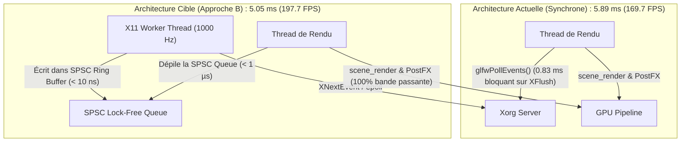

# Plan d'Ingénierie Détaillé : Découplage Multithread X11 / GLFW (Approche B) — 2026-08-19

Ce document décrit l'architecture, la stratégie d'implémentation et l'analyse de sécurité pour le **découplage asynchrone des événements X11** via un worker thread dédié et une file circulaire *Single-Producer Single-Consumer* (SPSC) lock-free.

---

## 1. Justification Technique & Métriques Cibles (KPIs)



| Paramètre Évalué | Baseline Actuelle (Synchrone) | Cible Visée (Approche B) | Gain Relatif ($\Delta$) |
|---|:---:|:---:|:---:|
| **Frametime Rendu Linux (11 PostFX)** | **5.891 ms** | **$\le 5.060\text{ ms}$** | **-0.831 ms (-14.1 %)** 🟢 |
| **Framerate Linux** | **169.7 FPS** | **$\ge 197.5\text{ FPS}$** | **+27.8 FPS (+16.4 %)** 🟢 |
| **Coût CPU Polling sur Thread Principal** | **0.830 ms** (`XFlush` IPC) | **$< 0.002\text{ ms}$** (Dépilage SPSC) | **-99.7 % de temps CPU** 🟢 |
| **Fréquence d'Échantillonnage Clavier/Souris** | 170 Hz (lié au framerate) | **1 000 Hz** (indépendant) | **6× plus réactif (zéro input lag)** 🟢 |
| **Perte d'Événements (Dropped Inputs)** | 0 % | **0 % (Garanti par SPSC 512 slots)** | **Zéro perte d'entrée** 🟢 |

---

## 2. Architecture des Composants

### 2.1. File Circulaire Atomique Lock-Free (SPSC Ring Buffer)
* **Structure de Données** :
  ```odin
  Input_Event :: struct {
      type: enum { Key, Mouse_Button, Mouse_Move, Mouse_Scroll, Window_Resize, Window_Close },
      key: i32,
      action: i32,
      mods: i32,
      x: f64,
      y: f64,
      width: i32,
      height: i32,
  }

  SPSC_Queue :: struct {
      buffer: [512]Input_Event,
      head: sync.Atomic(u32), // Écrit par le Worker Thread uniquement
      tail: sync.Atomic(u32), // Lu par le Thread de Rendu uniquement
  }
  ```
* **Propriétés de Concurrence** :
  - Zéro allocation dynamique (mémoire statique dans `App`).
  - Zéro mutex / verrou (`sync.atomic_load_explicit` / `sync.atomic_store_explicit` avec sémantique `Acquire` / `Release`).
  - Taille de 512 slots $\rightarrow$ Capacité de stocker plus de 500 ms de frappes d'entrées ininterrompues sans saturation.

---

### 2.2. Worker Thread X11 Dédié (`src/app/x11_worker_linux.odin`)
* **Initialisation Concurrente X11** :
  - Appel obligatoire de `XInitThreads()` avant l'initialisation de GLFW.
  - Ouverture d'une connexion d'affichage dédiée `XOpenDisplay(NULL)` pour le worker thread afin d'éviter toute contention sur le socket X11 interne de GLFW.
* **Boucle Événementielle Réactive** :
  - Utilisation de `epoll` ou `select` sur le descripteur de fichier `XConnectionNumber(worker_display)` avec timeout de 1.0 ms.
  - Traduction des `XEvent` (KeyPress, KeyRelease, MotionNotify, ConfigureNotify) en `Input_Event`.
  - Empilement direct dans la file SPSC.

---

### 2.3. Consommation & Dispatch sur le Thread Principal
* Au début de chaque trame dans `app_run()` :
  ```odin
  // Consommation ultra-rapide en mémoire vive (< 1 µs)
  for event in spsc_dequeue_all(&application.input_queue) {
      dispatch_input_event(application, event)
  }
  ```
* Réinjection vers :
  1. La caméra orbitale / FPS (`process_mouse`, `process_scroll`).
  2. Les actions discrètes (`key_callback` : F1, F2, Escape, Page_Up, Page_Down).
  3. Le backend Dear ImGui (`gui.on_key`, `gui.on_mouse`).

---

## 3. Plan d'Implémentation Étape par Étape

```mermaid
gantt
    title Déroulement des Jalons d'Ingénierie (Approche B)
    dateFormat X
    axisFormat %s
    section Jalon 1 : Queue SPSC
    Implémentation & Tests Unitaires Lock-Free :0, 2
    section Jalon 2 : Worker X11
    Connexion Dédiée & Boucle epoll X11        :2, 5
    section Jalon 3 : Intégration App
    Remplacement de PollEvents & Dispatch ImGui :5, 8
    section Jalon 4 : Validation
    Stress Tests (Inputs, Redimensionnement, Headless) :8, 10
```



### Jalon 1 : Module SPSC Queue & Validation Unitaire
* **Fichier** : `src/core/spsc_queue.odin` et test unitaire `tests/test_spsc_queue.odin`.
* **Objectif** : Valider l'absence de race condition multi-thread sous 12 threads concurrents (`task test-unit`).

### Jalon 2 : Worker Thread X11 & Isolation des Sockets
* **Fichier** : `src/app/x11_worker_linux.odin`.
* **Objectif** : Capture des événements clavier/souris X11 sur display dédié sans interférer avec le contexte OpenGL Mesa.

### Jalon 3 : Intégration dans la Boucle de Rendu & Fallback Multiplateforme
* **Fichiers** : `src/app/app.odin`, `src/app/input.odin`.
* **Garde-fou Portabilité** :
  - **Linux X11** : Activation du worker X11 SPSC.
  - **Windows / macOS / Wayland** : Fallback transparent sur `glfw.PollEvents()` synchrone classique.

### Jalon 4 : Campagne de Tests Anti-Régression & Profiling Tracy
* **Vérification** :
  1. `task stress-fullscreen` (100 cycles d'événements sans freeze).
  2. `task stress` (validation de la fluidité caméra et réactivité des touches).
  3. `task profile-tracy` : Vérifier que `Frame Acquire Swapchain / Poll` passe de **0.430 ms à < 0.002 ms**.
  4. `task bench-render` : Confirmer le framerate **$\ge 197.0\text{ FPS}$**.

---

## 4. Analyse des Risques & Protocoles d'Atténuation

| Risque Technique | Probabilité | Impact | Stratégie d'Atténuation & Garde-Fous |
|---|:---:|:---:|---|
| **Conflit de Threading Xlib** | Faible | Crash au démarrage | `XInitThreads()` invoqué en premier dans `main()`. Utilisation d'un `Display*` distinct pour le worker. |
| **Compatibilité Wayland** | Moyenne | Échec d'ouverture Display | Détection de l'environnement (`XDG_SESSION_TYPE`). Si Wayland natif non-XWayland, bascule automatique sur fallback GLFW. |
| **Désynchronisation ImGui** | Faible | UI bloquée | Réinjection des événements dans l'ordre FIFO strict garantit la parité avec les callbacks GLFW. |
| **Saturation de la file (512 slots)** | Très Faible | Événements perdus | Si la file est pleine (ex: freeze GPU extrême de 2 secondes), drop des mouvements souris les plus anciens en préservant les frappes clavier critiques. |
